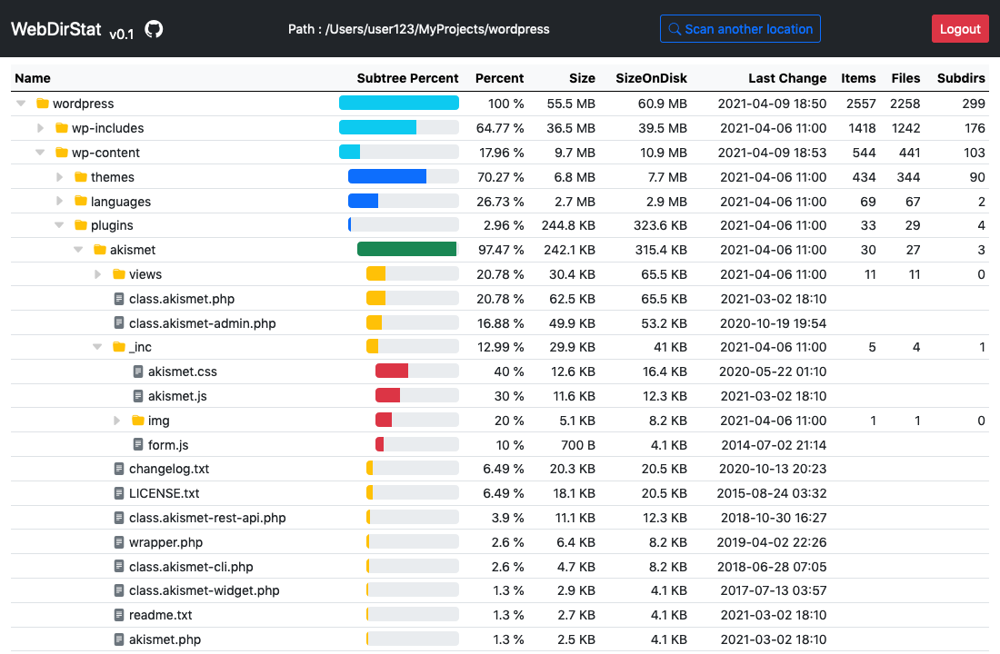

# WebDirStat

## Description

WebDirStat is disk usage utility for web servers, it’s a single PHP file that gives you statistics about disk usage inside a specific Directory ordered by size, in a form of a simple tree table.

It makes it easier to find out which files are taking up a lot of space on the disk, and which ones are useless to remove them manually later.

This tool is inspired by [“WinDirStat”](https://windirstat.net/)  on Windows and [“Disk Inventory X”](http://www.derlien.com/) on MacOS.

  
 
Its also show the statistics of files grouped by their type (PNG, JPG, HTML...)


## Getting Started

### Steps

1. Download only the file webdirstat.php (you can rename it if you want)
2. Open the file with a text editor, and modify this line:
   ```php
   $password = '' ;
   ```
   and change the empty password with a **strong** one.
3. Upload the file to your web server
4. Access the file via your web browser (e.g. http://you-web-server/webdirstat.php)
5. Enter the password you chose earlier
6. Select the folder you want to scan and click the button

Note: You can delete the file once you don't need it anymore. 

### Enhancements and bug fixes

* Add a Treemap like “WinDirStat” and “Disk Inventory X” if the browser can handle a big number of files, that can make more easy to detect big files.
* Add support for “Size On disk” on Windows.
* better extension statistics.

## License

 Distributed under the MIT License. See LICENSE for more information.

## Contact

Yassine - [yassine00fr@gmail.com](mailto:yassine00fr@gmail.com) 
